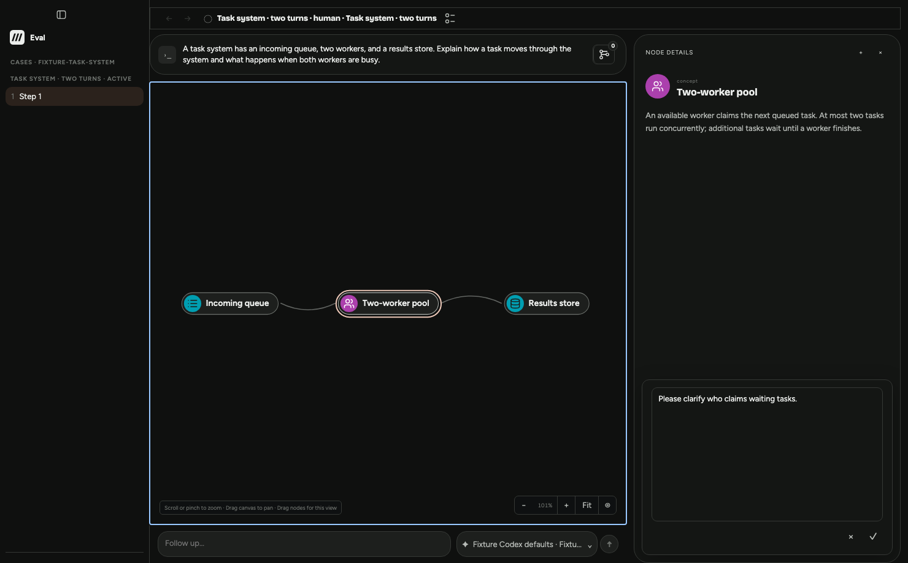
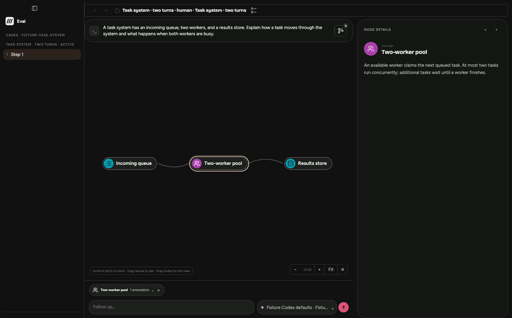
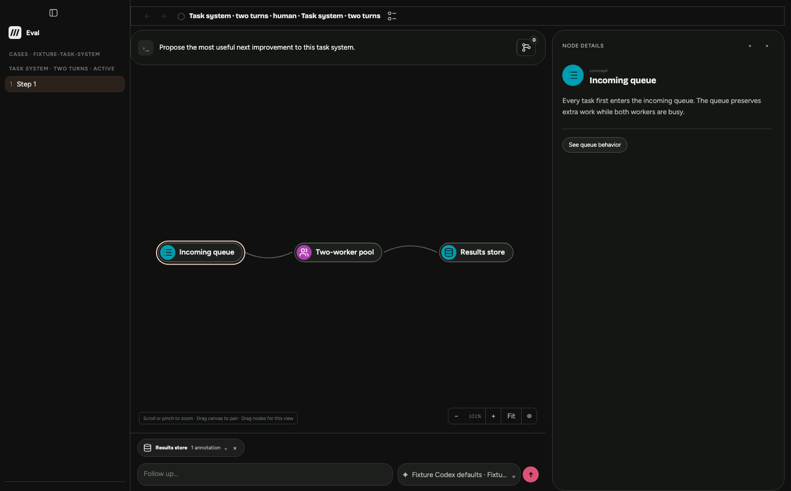

# Participant node annotations in interactive Eval

Product authority: PRD §7.1 and §13.2.3, ADR 0003 and ADR 0007; explicit
participant annotation decision of October 6, 2026.

Participant node notes already use the production context-draft editor and
ordinary task write admission on the starting main snapshot `649e0698`
(including PR #671). `/annotations` is evaluator comments and ratings, not
participant input. Its actor rejection and capability masking remain in place.
This change adds durable, server-owned simulated-session attribution to new
product-action and submission events and qualifies the existing note journey.
It does not backfill historical events or publish a new evaluator revision.

## Changed executable seams and checkpoints

| Promise or boundary | Production seam | Deterministic checkpoint |
| --- | --- | --- |
| Session identity cannot be supplied by the caller; attribution persists and exports | `HumanTaskService.write`, persistence and export | `test/eval-human-task.test.mjs`: simulated context writes, forged nested identity, reopen/export |
| Only the current task thread may save/confirm notes; terminal tasks cannot write | Task surface → serialized task admission | Same warm scenario, foreign PUT and foreign confirm POST, cancelled session PUT |
| Evaluator annotations, grading and internal authority remain inaccessible | Actor gateway; independent review surface | Same warm scenario plus existing `eval-web-host`/`eval-task-actor` cases and browser actor/review isolation |
| Ordinary visible controls save a durable participant draft and restore it after reload | Actor observation/browser → production node context editor → native draft backend | `scripts/test-eval-web.mjs`: `proveTaskActorAnnotations`, saved exact target and note, reload |
| Confirmation preserves the selected accepted node and exact source occurrence | Production confirmation and graph authority | Browser exact draft/confirmation/Send/turn target joins; existing Rust `confirming_a_node_context_draft_revalidates_and_replays_one_annotation` rejects unavailable, unreachable and changed canonical targets |
| Annotation-only Send consumes confirmed context once, delivers it to Complete, and preserves the chat turn | Production Send preparation and canonical `interaction.context` | Browser ordered four-completion input capture; real fixture independently rereads `graph.getInteractionInput`; native thread detail contexts, consumed confirmation removal |
| Invoke retains pending composer context and does not deliver it prematurely | Production action Invoke and composer persistence | Browser empty Invoke input and exact pending confirmation; later ordinary Send consumes it |
| Immutable portable evidence preserves annotation and anchor on the consuming turn | Native conversation export → task finish/export/reopen | Browser parsed exact exported turn contexts, portable source turn/layer/node joins, unchanged previous export bytes |
| Error description distinguishes evaluator feedback | Actor annotation-route denial | Existing denial plus new warm rejection |

The new browser chapter observes production input at the injected inference-free
harness seam. It does not mutate graph records or let the actor inspect hidden
state. Assertion-only backend reads check durable authority and input. The actor
still decides using screenshots and currently visible enabled control refs.

Existing typed-input browser coverage protects structured answers; existing human
annotation coverage protects evaluator comments/ratings. These are distinct
failure boundaries and remain. No tests were removed.

## Required verification plan

Warm loop: actor, human-task and web-host Vitest files. Before committing:
`npm run check`, `npm run build`, `npm run test:eval-web` (all chapters), and
`npm run test:eval-compiled-runtime`. The full deterministic check is the fallback
for the added evidence/runner paths; no affected-module narrowing is claimed.

Native setup found no compatible sealed runtime artifact. Existing local Cargo
intermediates were cloned into this isolated worktree; Cargo then built the
current source. They accelerate compilation and are not test evidence. Dependencies
were installed from this worktree's lockfile. Doctor passed on Node 24.19.0 and
Rust 1.98.0. Paid inference calls: zero. No deployment or release proof applies.

## Results and limitations

Final reviewed source passed all required local gates: 98 warm actor/session/gateway
tests; full `npm run check` (3,611 Vitest tests passed, three existing skipped,
two separate secret-boundary tests, 68 Python tests, native workspace/crash suites,
receipt lint and PRD readability); `npm run build`; all `test:eval-web` chapters;
and four compiled Complete tests. Logs and SHA-256 bindings are recorded in
`verification.json`. Skipped tests remain unclaimed. Live model adaptation and
human realism remain unverified.

## Source reviews

Reviewed source digest: `cc897415f08945581270c4c2fc0a8873f333140c4d184ee2fa5b08b5694dfa23`.
SHA-256 input, in order: `desktop/eval-main/human-task-service.mjs`,
`desktop/eval-main/web-host.mjs`, `scripts/test-eval-web.mjs`,
`test/eval-human-task.test.mjs`, `docs/prd/index.html`,
`docs/decisions/0003-shared-product-eval-workspace.md`. Each contribution is
its UTF-8 relative path, NUL, file bytes, NUL.

- `/root/authority_review`: participant attribution, historical immutability,
  semantic/UX/authority separation, exact occurrence, Send and Invoke. Verdict:
  no actionable source findings; unresolved source findings: none.
- `/root/context_trace`: checkpoint mapping, production browser/native-input
  proof, persistence/export anchors and test subsumption. Verdict: static review
  passed; unresolved source findings: none. No tests were deleted.

Both reviewers independently recomputed the digest. Their assertions apply only
to these bytes and do not independently certify execution. The final browser
rerun, check and build results below own execution proof.

## Preserved failures

The first full browser attempt failed in the reload scenario because the probe
read before debounced autosave committed. The proof now waits for durable save
before reloading; no production autosave behavior was changed. The original
failure is retained in `browser-attempt1.txt`.

The first warm fixture tried `budget_exhausted` before exhausting its budget;
the fixture now uses actual cancellation for terminal-write rejection. A warm
rerun overlapped build's dist cleanup and could not resolve Eval-runner; verification
was rerun sequentially after build. These attempts are not counted as passes.

The first full check passed its native suites and 3,609 JavaScript tests, but
telemetry suite loading failed because `npm ci --ignore-scripts` had not installed
the pinned Electron 43 binary. `npm rebuild electron` completed the isolated
setup; both telemetry tests then passed. `check-attempt1.txt` preserves the failed
outer result. The full check was rerun rather than treating that partial result
as a pass.

These are the actual pinned-Chromium production workspace at 1480×920, with
inference-free actor decisions. They show participant context controls; they do
not establish live model adaptation or Electron-specific UX.
