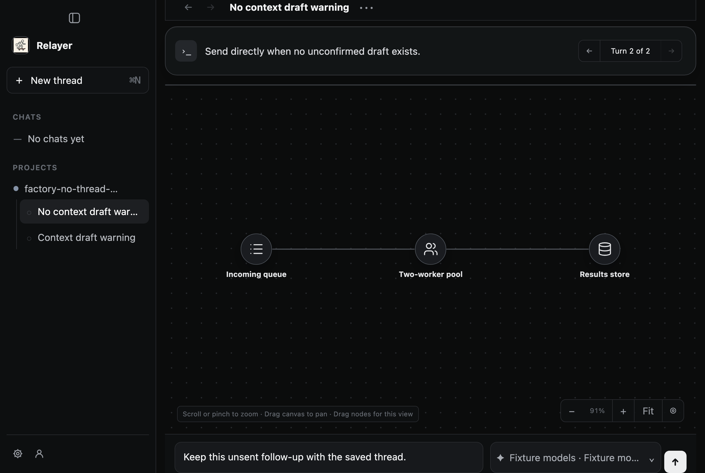
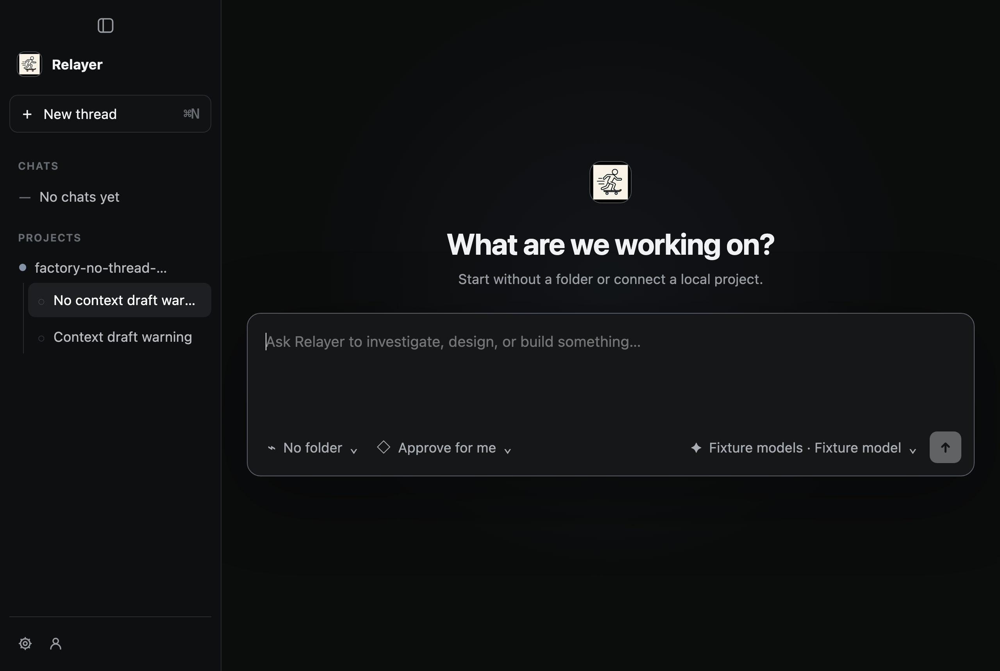
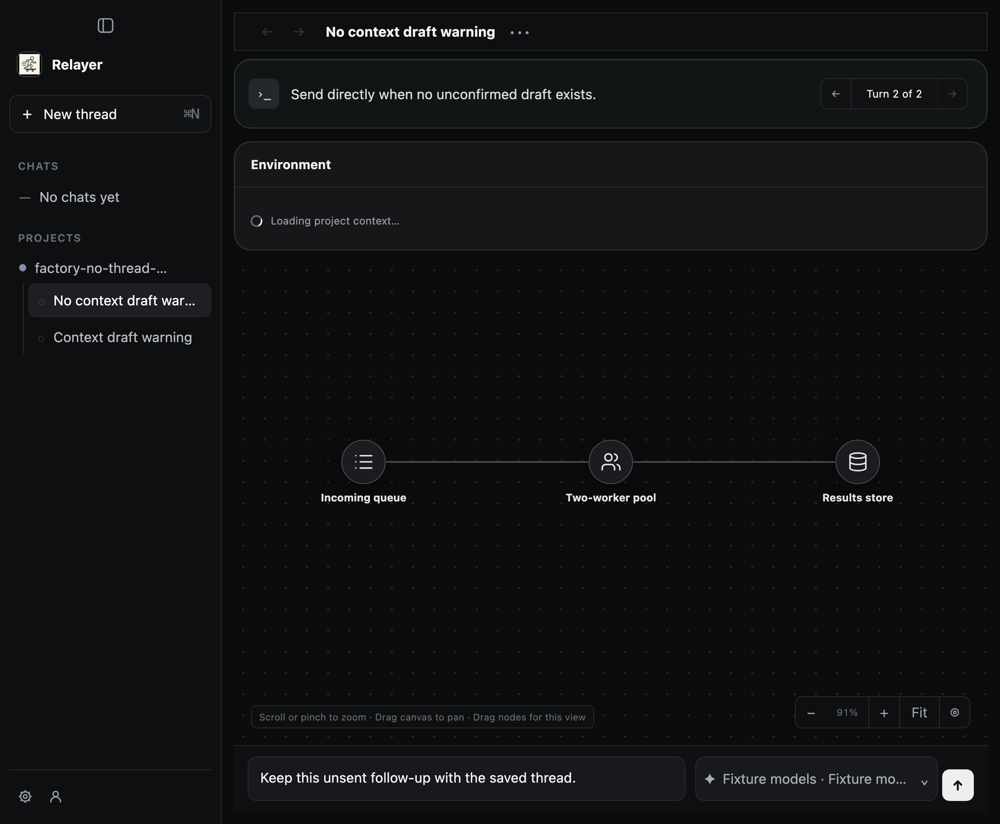

# PR 487 follow-up evidence: New Thread draft transition

This desktop capture exercised product commit `1b037c26acc3e2ec51c1384d6b7efd8d55f94fb8` (tree `acf1e586ef93d64eb726e39373a6845deb146dfb`). The product worktree was clean before capture. Relevant source hashes are in `product-source.sha256`; the native server executable hashes used by the capture are in `native-binaries.sha256`. Verification commands and exit receipts are under `verification/`. Full command output remains preserved in the external run archive; `inner-result.json` carries the complete desktop scenario output. Node was v22.23.2, Electron v43.0.0, and Vitest v4.1.10. No inference was used.

The desktop runner clicked the ordinary **New Thread** button in a saved thread with an unsent follow-up. It then returned to that saved thread. `inner-result.json` is the durable inner scenario output from the runner. The runner classified each captured PNG with macOS Vision OCR and used contiguous matching-frame timestamps for readability intervals:

- Saved follow-up before navigation: 1,606.9 ms across captured frames 1–6.
- Empty New Thread composer after button click: 1,720.8 ms across captured frames 7–12.
- Saved follow-up after returning: 1,588.6 ms across captured frames 13–18.
- All exceed the runner's 1,400 ms evidence threshold. This is a capture readability rule, not a product requirement.
- The H.264 video is 5.68 seconds at 2560 × 1720. The runner decoded it successfully. Three video-derived samples are included and were visually inspected at 1.1 s, 2.85 s, and 5.2 s.

[Open the complete transition video](new-thread-transition.mp4)

The saved-thread state is visible before and after the transition. The captured return screenshot also shows an Environment panel in a loading state; the runner makes no claim about that unrelated panel. BrowserWindow recreation was exercised; app-process and service restart were not. The async reselection report remains conditional and was not reproduced by this scenario.

The first focused run failed on two newly introduced test assumptions. The classifier accepted a screenshot with mixed state hints, and the reselection test asserted unrelated node detail text before rendering settled. Both failures were retained in the external run archive; the corrected focused run passed 47/47. Earlier capture artifacts and failure history remain in the separate original evidence run directory and were not overwritten.

`product-source.sha256` hashes the changed product source files; the product commit and tree IDs bind the complete committed source snapshot. `native-binaries.sha256` records the app-server and graph-server executable hashes used by the capture. `inner-result.json` preserves the inner scenario output. `SHA256SUMS` covers the complete published bundle except itself.
