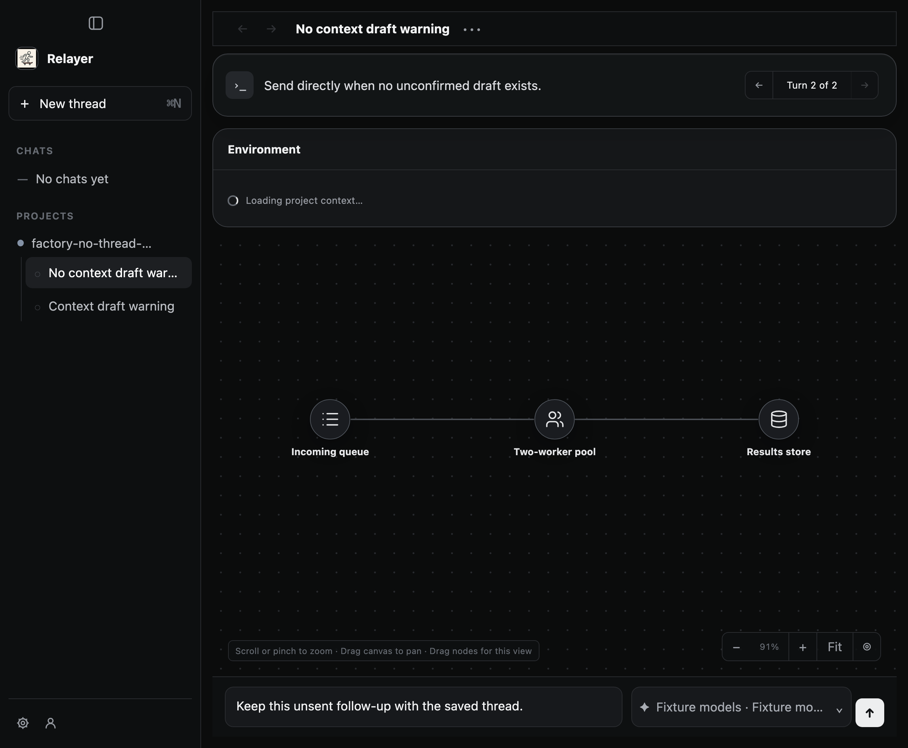

# PR 487 retained-screenshot receipt evidence

Source under test: product commit `f85f03f6723791119fae16971b2ed1db4d85cec5`, tree `ae86c2cf628e7dff4367c9132188a04e7b586bed`. The product worktree was clean after commit. This is a separate capture run from the earlier published evidence at commit `69f324f2f865d5e84ddcd847bb543b047d82bb13`; that run remains unchanged and valid. Source file hashes and native server binary hashes are included here.

The corrected regression writes one byte sequence to a screenshot file, replaces it with different retained frame bytes, and asserts the file-hash receipt equals the known digest of the final bytes. The first run was red because the new seam did not exist; the focused suite then passed 48/48. The full check and build passed on the committed source.

This new capture's initial saved-thread screenshot and first matching recording frame happened to have equal bytes. The runner reported the SHA-256 of the retained screenshot file, and `capture-receipt-validation.json` independently confirms that it equals the retained file hash. The different-byte regression protects the repaint/replacement case that did not occur in this particular visual run.

[Open the source-bound transition video](new-thread-transition.mp4)

The video is H.264, 5.44 seconds, 2560 × 1720, and decoded successfully. Captured OCR intervals were 1,515.4 ms saved-thread before navigation, 1,668.1 ms empty New Thread, and 1,525.5 ms after returning. These exceed the capture-only 1,400 ms rule; it is not a product requirement. The actual button case reported `currentThreadId:null`, `activeThreadId:2`, and preserved the draft.

The return image still shows an Environment panel loading. BrowserWindow recreation was tested; app process and services were not restarted. No claim is made about that panel or process restart. The reported async reselection remains conditional and unreproduced.

`inner-result.json` contains the full desktop scenario result. `capture-receipt-validation.json` records the returned hash and independently measured retained-file digest. `SHA256SUMS` covers every published file except itself. Full unmodified stdout logs and prior failed/unknown history remain in the external run archive; command names and exit summaries are linked under `verification/`.
