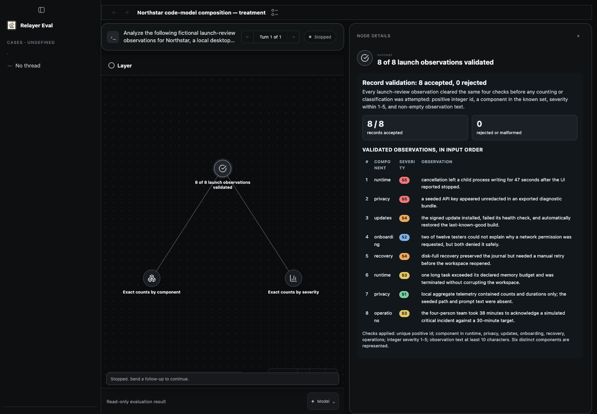
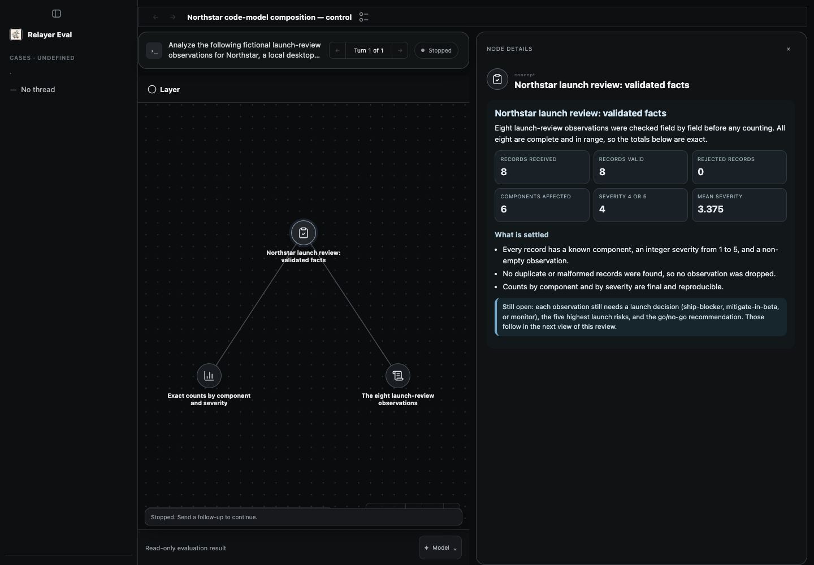

# Harness code/model composition experiment

This is an opt-in Prime Agent experiment, not a production rollout. It tests
whether ordinary Python can call the admitted model, consume the returned value,
branch and recurse locally, and then publish the resulting work through the
existing graph API. It does not test semantic `complete(inputGraph)` recursion.

## Product decision and executable seams

The explicit decision is to test model calls as values inside ordinary code
without turning each call into a GraphComplete completion.

- `code-model-recursion-v1` is accepted only by `prime.agent`. Codex rejects it
  before provider execution.
- The treatment registers `relayer.experimental.model.complete` only for its
  active run. The handler accepts one non-empty prompt of at most 16,000
  characters.
- The host calls `pi-ai` with the exact admitted orchestrator model and request
  access. It supplies no tools, performs no automatic host retry, caps output
  at 1,024 tokens, and returns only text plus provider usage. Credentials never
  enter Python or the trace.
- The active run and request cancellation signals bound every call before and
  after provider dispatch. Each call emits sanitized start and completion trace
  events with a safe caller ID, parent ID, depth, host call index, and
  prompt/output SHA-256 values. Prompt and result text stay out of the trace.
- The returned text has no graph or completion authority. Python must parse it,
  choose a branch, bound any recursion, and explicitly use the existing graph
  API to publish. Prime RLM remains a separate native recursive mechanism, and
  only `complete(inputGraph)` creates a semantic child.
- The control omits the setting and never registers the host request. No code in
  this change adds a scheduler, queue, publication rule, graph operation, or
  semantic completion.

## Deterministic checkpoints

| Promise or boundary | Smallest deterministic checkpoint |
| --- | --- |
| The Python reference receives a returned value and changes local recursion and later publication from it | `experimental-authoring-guidance.test.ts` executes the reference with deterministic fake host and graph boundaries under split and stop counterfactuals |
| The production host bridge dispatches the admitted model call with the declared restrictions | `prime-agent.test.ts` injects only `pi-ai.completeSimple`, then observes exact model/endpoint/access, no tools, no automatic host retry, the token bound, result extraction, and usage mapping |
| The request uses the admitted model/access while keeping credentials host-only | `prime-agent.test.ts` injects the one-shot completer, verifies the exact root access, and excludes the secret from traces |
| Stale or cancelled requests cannot continue | the Prime test rejects a stale generation and rejects a non-cooperative result that resolves after request cancellation |
| Model calls remain correlatable without becoming semantic children | the Prime test requires ordered `experimental.code_model_call` events with safe call-tree fields and prompt/output digests; no completion broker is involved |
| Production control has no new callable surface | the Prime control test requires the host-request name to be absent |
| Provider ownership is explicit | Codex construction rejects the Prime-only strategy before execution |

Focused entry:

```sh
npx vitest run \
  packages/harness-host/test/experimental-authoring-guidance.test.ts \
  packages/harness-host/test/codex-basic.test.ts \
  packages/harness-host/test/prime-agent.test.ts
```

Repository-required final gates remain `npm run check` and `npm run build`.
They use no paid inference.

These checkpoints deliberately split the Python and production-host boundaries.
They do not claim an assembled real-provider/real-graph pass. Only the frozen
live screen below can establish that composition on one execution.

## Frozen live feasibility screen

Live inference is not authorized by this file. Before any live turn, record a
positive dollar cap and freeze the exact source, built bundles, binaries,
configuration, task, arm order, and gate hashes. Do not edit those inputs during
the screen.

The initial screen contains exactly two serial roots on one admitted Prime model:
one control and one `code-model-recursion-v1` treatment, in an order randomized
and recorded before inference. Each root gets fresh product data, workspace,
Prime private state, trace spool, and configuration. Each has a 600-second
deadline, one stop request, a 30-second settlement grace, and no root rerun. The
host bridge also disables automatic provider retries. A new agent-authored call
with the same prompt remains observable as a semantic retry and is a protocol
deviation rather than a hidden host retry. A failure remains evidence. This
two-root feasibility screen is not a performance comparison or evidence of
general improvement.

Both roots receive this exact task:

> Analyze the following fictional launch-review observations for Northstar, a
> local desktop agent. Build and run a reusable Python analysis that alternates
> deterministic computation with bounded language-model judgment when that is
> available in the execution environment. First validate the records, compute
> exact counts by component and severity, and publish a truthful current graph
> containing those facts. Then classify each observation as `ship-blocker`,
> `mitigate-in-beta`, or `monitor` with a concise rationale. The classification
> function must accept a batch, ask for strict JSON, parse the returned value,
> and let that value decide whether to finalize the batch or recursively split
> it into smaller batches. Bound recursion at depth 2 and reject malformed
> output rather than inventing a result. Print one compact private JSON receipt
> containing the call IDs, parent IDs, depths, host call indexes, digests,
> parsed decisions, and taken branches. Publish a final navigable graph that
> includes the deterministic aggregates, every classification and rationale,
> the five highest launch risks, and a concrete go/no-go recommendation. Keep
> the graph entirely in Northstar task terms; do not expose call trees, digests,
> internal IDs, or execution mechanisms there. Do not create a semantic child
> for an individual classification.
>
> Records, in input order:
>
> 1. `runtime`, severity 5: cancellation left a child process writing for 47
>    seconds after the UI reported stopped.
> 2. `privacy`, severity 5: a seeded API key appeared unredacted in an exported
>    diagnostic bundle.
> 3. `updates`, severity 4: the signed update installed, failed its health check,
>    and automatically restored the last-known-good build.
> 4. `onboarding`, severity 2: two of twelve testers could not explain why a
>    network permission was requested, but both denied it safely.
> 5. `recovery`, severity 4: disk-full recovery preserved the journal but needed
>    a manual retry before the workspace reopened.
> 6. `runtime`, severity 3: one long task exceeded its declared memory budget and
>    was terminated without corrupting the workspace.
> 7. `privacy`, severity 1: local aggregate telemetry contained counts and
>    durations only; the seeded path and prompt text were absent.
> 8. `operations`, severity 3: the four-person team took 38 minutes to
>    acknowledge a simulated critical incident against a 30-minute target.

The judgment prompt inside Python must require one JSON object with `split`,
`reason`, and `decisions`. The heterogeneous root batch should be split; leaf
batches may finalize. The model controls that branch, so failure to split is an
observed treatment failure and is not retried.

### Frozen rubric

The treatment passes the mechanism gate only when all are true:

1. Trace evidence contains at least three completed experimental model calls,
   with one depth-0 call followed by calls on smaller batches. Safe call IDs,
   parent IDs, depths, and prompt/output digests must be internally consistent.
2. Python parses returned text, and the depth-0 returned `split` value causes the
   observed recursive call tree. Merely calling the model or naming a recursive
   function does not count.
3. Executed Python, native output, and host trace together bind each input batch,
   returned decision, taken branch, and depth. The later graph contains the
   resulting classifications without exposing those execution mechanics.
4. The root publishes at least one deterministic factual current before the
   judgment calls and later publishes or submits a graph incorporating their
   results.
5. No Prime RLM child or semantic GraphComplete child is used for the individual
   judgments. The final root settles accepted without an authority or integrity
   defect.

Content review separately scores one point each for: exact component/severity
aggregates; all eight classifications; rationales grounded in the supplied
facts; correct treatment of the two severity-5 failures; five ranked risks;
concrete go/no decision; readable root overview; and useful navigable detail. A
credential disclosure, false execution claim, exposed execution mechanics,
missing observation, or accepted graph that contradicts the trace is critical
failure regardless of score.

The control establishes whether the ordinary Prime root can solve and present
the task without the new callable surface. It is not expected to pass the
code/model mechanism gate. The treatment intentionally combines callable
availability with instructions for using it, so this screen tests feasibility
of that composite treatment and cannot attribute an outcome to either part
alone. Timing and token usage are descriptive only.

## Current evidence

The focused deterministic checkpoints pass locally. The frozen two-root live
screen then ran on clean commit `e3b77c36246dbcdd899c70c16946551e3e0f186e`
with treatment first. Source, binaries, bundles, configurations, task, rubric,
gate, runtime, and model identities matched before and after both roots. Each
arm used a separately validated managed runtime with empty private state.

The machine-readable receipt is
[`live-screen-2026-09-29.json`](./live-screen-2026-09-29.json). Raw provider
sessions, local databases, auth material, and detailed traces remain in the
ignored local evidence directory. The committed receipt contains only hashes,
sanitized aggregates, and the two stopped review screenshots.

The treatment published a useful factual current after 81.240 seconds. It then
made 33 experimental model calls: 10 completed, 22 failed, and one was cancelled
at stop. The calls used only 14 unique prompt digests; one identical prompt was
issued ten times, including explicitly named retry calls. This violated the
task's no-semantic-retry intent even though the host performed no automatic
retry and the runner did not rerun the root. All 33 calls stayed at depth zero
with no parent. The root parsed some successful JSON, but it never produced the
required returned-value-driven recursive call tree. It stopped at 600.536
seconds without classifications or a final graph.

The control published a useful factual current after 290.963 seconds. It also
reached the 600-second deadline without a final graph. Its current moved to
stopped, while the interaction still reported running after the 30-second
settlement grace. That mismatch is preserved as
`stopUnsettledAtGraceDeadline`; it is not treated as a successful settlement.
The control used one provider-native RLM worker for judgment and emitted 593
child updates. The treatment used no RLM child. Neither arm created a semantic
GraphComplete child.

Both visible currents scored 3/8: exact aggregates, a readable overview, and
useful navigable factual detail. Neither graph contained the eight required
classifications, rationales, five ranked risks, or a go/no recommendation. The
treatment's faster first current is descriptive only. There is no settled
comparison, no quality improvement, and no mechanism pass. Provider dollar
cost was reported as zero, which this receipt treats as unavailable rather than
as proof of a zero-cost run.
The pre-run protocol required a positive dollar cap, but none was recorded.
Direct user authorization allowed these two roots to proceed; the receipt still
marks the budget checkpoint failed and does not claim full protocol compliance.
Browser inspection proved the stopped layouts below, but no contemporaneous
hashed observation log exists, so the receipt makes no exact renderer-time claim.





This is a bounded negative feasibility result. It proves that the callable can
return values to executed Python under the admitted Prime route. It does not
prove the intended recursive composition or support a production default. The
receipt binds the pre-rebase commit only; later source snapshots do not inherit
its exact-source live status.
