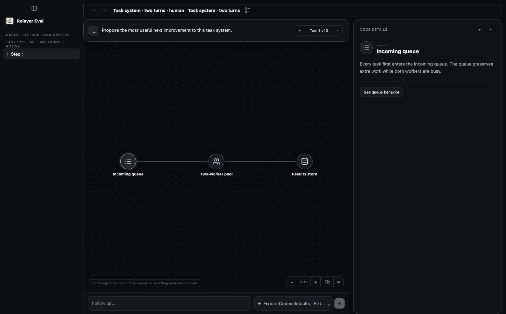

# Issue 544 — simulated task user

This report records the original slice-2 snapshot. The subsequent user-approved
calibration changes and their verification are in [actor v2](actor-v2.md).
The original review digest below does not certify those later source changes.
Current merge-readiness repairs and pending gates are recorded in
[merge readiness](merge-readiness.md).

Product authority: PRD §13.2.3 and ADR 0003. This is slice 2: an actor
operating the production task workspace between settled responses. In-turn
input simulation, independent observers, private taste profiles, and human
calibration remain separate work.

## Changed seams and checkpoints

| Promise / boundary | Production seam | Deterministic proof |
| --- | --- | --- |
| Separate versioned actor configuration and restricted native inference | `task-actor.mjs`, eval-runner `simulated-user/task-actor.ts` | `eval-task-actor.test.mjs`: native configuration, prompt and environment projection |
| Adapt to current rendered state while preserving admission and budgets | `task-actor-service.mjs` → `HumanTaskService.write` | Actor test: adaptive trajectory, unknown write, action limit; browser: Send and invoke |
| Wait for the submitted response to render, including same-turn retry attempts | Service submission identity, renderer presentation, browser readiness predicate | Actor tests: stale failed-attempt presentation and actual settled retry identity; browser: latest accepted turn after invoke |
| No action during product execution; cancellation reaches reads, writes and inference | Service settlement, browser context, gateway abort signal | Actor tests: settlement, queued intent, persisted satisfaction, pending read/write, native deadline and service close |
| No replay after uncertain submission | Existing durable admission reservation | Actor unknown-write/reopen test and existing human-task tests |
| Actor satisfaction stays independent of human grades and objective checks | Actor events, human grade, finish, immutable export | Actor test: reopen/export with disagreement and failed objective check; browser: active human grade and completed export |
| No evaluator feedback or broader capability reaches actor | Projected actor surface and denied annotation routes | Actor surface route tests; browser: separate live reviewer and actor contexts |
| Only pixels and visible enabled controls; stale refs fail | `task-actor-browser.mjs` | Browser: clipped control excluded, forged/stale refs rejected, node selection, compiled node input, Send and invoke |
| Active actor review permits grading but no product mutation or Finish | `index.mjs`, review surface and `human-task-grading.js` | Browser: grade in active graph review, no Finish control, product write 403, actor continues without human feedback |
| Dashboard configuration/start/stop and host lifecycle | Human Grader UI/bridge/RPC, `index.mjs` | Browser: mode/config/start, real-index disconnected runtime rejected before candidate creation; service cancellation tests; source review of Stop dispatch and shutdown ordering |
| Preserve human-session behavior and provider/model authority | Existing task routes and optional signal propagation | Existing session/web/service tests; browser human follow-up, setup authority, finish/export, real-index process restart |
| Select actor tests in CI | `affected-modules.v1.json` | `ci-affected-plan.test.mjs` for desktop and eval-runner changes |

## Required verification plan

Run warm actor, human-session and gateway tests during edits. Before handoff,
run `npm run check`, `npm run build`, and all chapters of
`npm run test:eval-web`. These tests use fixture model decisions; none invokes
paid inference. The browser proof retains production rendering, real native
product servers, model-admission receipts, and task routing.

## Browser coverage and subsumption

The human follow-up chapter now uses the existing task-system fixture with
inert provider/model acquisition and accepted native attempt receipts. The old
receiptless historical fixture is correctly non-continuable under current
conversation compatibility rules. Production compatibility policy was not
changed to make the test pass.

The replacement retains composer input, two completions, timing observation,
node annotation, live and completed grading, export, presentation persistence,
and failed-grade draft preservation. A separate executable-index chapter
retains the host startup/RPC/finish/export/shutdown/restart boundary and verifies
persisted read-only review with rejected product writes. Native product restart
also verifies the admitted conversation remains compatible. These chapters
protect different process and admission boundaries; neither subsumes the other.

The actor chapter inspects a node, fills the composer, sends, selects another
node, invokes an action, and verifies the latest accepted response before
finishing. It saves a human grade from a separate read-only review while the
actor is active. A second actor chapter fills a rendered compiled node input,
commits its draft and sends through the real product routes; exported evidence
retains the supplied answer.

## Verification results

Final browser run: all nine chapters passed, including active human grading,
node input, Send/invoke, and process restart. Independent focused verification:
50 tests across actor, human-task and web-host suites passed. Full `npm run check` passed: Rust formatting/clippy/workspace/crash recovery,
package builds and type checks, 3,223 JavaScript tests (three skipped), two
secret-boundary tests, 60 Python tests, native receipt lint and PRD readability.
See [check summary](check-summary.txt) and [browser summary](browser-summary.txt).
Final `npm run build` passed on the same reviewed source. All required deterministic gates passed; the three existing skipped JavaScript tests remain unclaimed.

The screenshot is the production workspace shown to the fixture actor after
its third admitted completion. It demonstrates the observation surface, not
live model adaptation.

Earlier evidence: 100 focused tests across seven files passed after correcting
the native SDK package boundary and stale local binaries. Nine browser chapters
passed before the last retry/read-only-active-review additions. Those runs do
not certify the final snapshot.

Failures encountered and repaired:

- The first full check found the SDK added at the desktop root. Native actor
  transport now belongs to eval-runner, which already owns this dependency.
- Two existing native end-to-end tests used the worktree's stale `target/debug`
  link. Pointing that local link to current source-built binaries made both
  unchanged tests pass. Existing user preview processes were not restarted.
- The old human fixture could not Send under current admission rules; the
  replacement above preserves the original boundaries with valid receipts.
- A browser assertion caught an old graph after invoke. Observation now waits
  for after-paint thread/turn/attempt identity, not backend settlement alone.
- One intermediate browser run timed out on the existing Settings family
  selector. Subsequent complete runs passed that unchanged chapter.
- Adversarial review identified cancellation races, annotation exposure,
  clipped DOM text, a nonfunctional Finish control in active review, and stale
  retry presentations. The resulting tests exercise those boundaries directly.

## Native artifact provenance

No cold native provisioning or downloaded cache was needed. The existing warm
Cargo target built the repository's native source at base `f9ce3209`; this change
has no Rust edits. Private copies isolate browser proof from other worktrees'
builds. SHA-256:

- app server: `bc37bd089ed2f4fade78a2a3547baa9395470658f34b6a2942a1a250c1ac6805`
- graph server: `a277448c2cab1d0e0a989ff3f4fb27d97e2d8eb51834c3551d39691b5ba78a61`

## Limits

No live Luna call, calibrated human realism, useful-first-graph latency,
independent observer, automatic improvement, or desktop release proof is
claimed. Native transport tests verify options and rejected tool traces with
an injected SDK; they do not certify a paid native-model run. The initial actor
browser opens after candidate dispatch, so its first-visible-graph latency is
not suitable for responsiveness comparisons. Human review cannot steer the
actor. Actor action/completion limits are not monetary cost caps.

## Adversarial review

Reviewer `/root/eval_facts` independently reviewed the 21-file scope in
[review-scope.json](review-scope.json), digest
`6102fb0b74d4f5b3ad0ffc5eb4a3ad741d6c8e356f1a46c0b641d8d28065b956`.
The digest hashes sorted relative path + NUL + raw SHA-256 file digest for
each entry. Verdict: no actionable source findings in authority isolation,
cancellation/no-replay, exact retry-attempt readiness, and preservation of the
host/human browser-test boundaries. Independently ran 50 tests successfully.
Stop-button wiring and shutdown ordering are source-reviewed; service tests
prove actor cancellation, while the browser separately proves process restart.
Any change to that scope invalidates this assertion. Source review does not
substitute for the required gates or live-model proof.

## Overnight actor recovery (2026-10-01; verification in progress)

The ten-case live batch preserved ten interrupted trajectories, not successful
results. Nine action-associated failures involved graph-node clicks; one happened
between observation and an actor decision. Raw errors were intentionally absent
from exported evidence, so the generic category did not establish the cause.

Changed executable seams and checkpoints:

- Actor browser node resolution: keep opaque references, but allow a detached
  graph-node handle to resolve only to one identical node in the same observed
  thread, turn, layer, attempt, selected-node and navigation scope. Names alone
  never resolve a target. Normal visibility, hit testing and browser clicks remain.
  The real-browser actor chapter replaces an observed graph element using the
  production DOM-replacement pattern and real activation callback. It verifies
  selection after rebinding and rejects changed labels/scope, duplicates and hidden
  replacements. Forged and expired observation references still fail closed.
- Error classification and action validation: closed categories distinguish stale
  controls, unavailable controls and invalid actions without logging raw provider
  payloads. `test/eval-task-actor-errors.test.mjs` verifies safe classification.
- Deadline admission and execution: the user's overnight request permits sufficient
  interaction time. PRD §13.2.3 records configurable one-to-sixty-minute deadlines,
  retaining the fifteen-minute default. One signal spans startup and the run;
  `test/eval-task-actor.test.mjs` verifies configured timeout selection, bounds,
  cancellation and no extension. Case budgets and AI stopping decisions remain.

The natural-poll hypothesis did not reproduce in the deterministic fixture. A
forced same-presentation DOM replacement did reproduce the runtime failure before
rebinding. The initial repaired browser suite passed all twelve chapters. This
establishes the detached-DOM failure boundary; a live canary is required before
claiming it explains the saved failures. Additional adversarial checks and full
check/build are pending. Focused actor/error tests passed 32 tests.

Failed runs and subsequent attempts remain distinct. More actions, longer time,
or actor-reported satisfaction do not establish independent endpoint attainment.
Any new actor revision must preserve its predecessor and real motivating feedback;
there is no automatic promotion. Genuine failures and incomplete endpoints belong
in the final report alongside successful outcomes.

The restaurant failure was independently traced to its final structured response:
`reason` contained prose although finish validation required an enum. Actor v4
constrains that field in the native output schema and locates explanations in
`comment`. The service passes each revision's pinned schema, including historical
unrestricted schemas. The registry test reopens a sealed legacy record and proves
that old and new schemas remain distinct at dispatch. The SDK test observes the
actual native `run` output schema. The focused three-file suite passed 46 tests.

The repaired live canary preserved three submissions and successful node actions
before its original fifteen-minute deadline. The first graph took roughly nine
minutes. It ended `actor_timeout`, not success. This is live evidence that node
interaction can proceed, not proof that all earlier failures had the same cause.
The next revision gives each case sixty minutes and retains its case completion
budget; the AI user still decides its actions and stopping outcome.

Recovery verification: `npm run check` passed (276 test files, 3471 tests;
three tests skipped, plus the separate two-test secret-boundary pass). `npm run
build` passed. The final `npm run test:eval-web` passed all twelve chapters,
including the replacement-node negative cases and real node activation.
An earlier browser invocation overlapped package rebuilding and timed out before
native startup; it is retained as an unsuccessful attempt, not product proof.
The complete sequential-build browser rerun passed.

Follow-up boundaries found during adversarial/live review:

- Editing a historical actor revision now accepts only the exact known legacy
  contract and upgrades the newly published revision to the current code-owned
  schema. Earlier revisions remain byte-preserved. The registry regression uses
  the editor's predecessor-copy payload (failed before the fix, passed afterward).
- The setup editor exposes the pinned deadline in minutes and preserves the chosen
  value during publication/reopen. The browser chapter verifies sixty minutes.
- A single-step local-weekend run chose `next_step` and was interrupted. Actor v5
  supplies currently available action kinds and narrows the pinned native schema
  before each decision. `next_step` is absent at the last step or exhausted budget.
  The effective schema is saved with its observation; the actor still chooses the
  next action. One- and two-step real-service tests failed before this repair and
  passed afterward. The SDK seam verifies forwarding the narrowed schema. These
  changes neither replay the failed action nor turn an interrupted run into success.

The focused actor, registry and safe-error suite passed 48 tests after these fixes.
Earlier full-gate results certify the preceding snapshot only; full final checks
remain required for this follow-up snapshot. Active v4 runs retain their original
runtime and are assessed separately from any v5 rerun.

Workspace refresh exposed another boundary: a well-formed finish claimed reached
while listing remaining work. The authority check still rejects that declaration.
A single bounded fresh AI decision can now reconsider it with fixed validation
feedback and a new observation. Both rejected action and usage are recorded;
fields are never rewritten. Repeated contradictions and exhausted action budget
still interrupt. Unknown actions, product-write errors and provider failures are
not retried. Focused production-service tests cover repair-to-incomplete and
repeated contradiction, with zero product dispatch. The focused suite now passes
53 tests. Browser observation allowlists explicitly cover action availability and
continue excluding evaluator state; full final gates remain pending.

Terminal contradictory finishes also retain their exact bounded action and usage,
with `retryAllowed: false`. A last-slot regression proves no budget extension.
The first v5 browser attempt correctly failed its old observation-key allowlist;
the updated allowlist explicitly permits only action admission metadata alongside
controls, screenshot and text. The complete twelve-chapter browser rerun passed.

An independent native-metadata audit then found all eight everyday candidates
running in the parent Relayer repository, not their materialized task folders.
Those runs are preserved but excluded from clean outcome evidence. The external
catalog now owns isolated Git seeds with new materializer/environment and case
identities. The host requests the exact subfolder and verifies its canonical
returned project path before any candidate dispatch. The service regression
returns an ancestor project and proves rejection before thread creation; it
failed before the guard and passed afterward. Native cwd validation is required
on all replacement everyday runs. The two coding cases used correct workspaces;
their objective failures remain valid negative evidence.

Final deterministic gates for the v5/isolation follow-up passed: `npm run check`
(3479 tests passed, three skipped, plus two secret-boundary tests), `npm run build`,
and all twelve `npm run test:eval-web` chapters. The preceding full check had one
failure in an outdated fake project response; its correction creates the fixture
folder and returns the real API's path field. The corrected 28-test suite and the
subsequent complete check both passed. Earlier failed logs remain diagnostic
history, not passing proof. Replacement live runs remain separate evidence.

## Pre-dispatch control recovery (2026-10-01)

The isolated v5 community trajectory observed “Open pilot runbook” after one
successful node click, then ended with `unavailable_control` in the action phase.
This proves rejection at the browser's availability check, not whether the cause
was DOM replacement, visibility, an overlay, or disabled state. The saved failed
trajectory remains unchanged.

Changed seams: the browser marks only stale/missing and unavailable-control
checks before click/fill/select as `actionDispatched: false`. The actor service
requires that marker and exact error categories before permitting one new AI
decision after a fresh observation. Fixed feedback describes unavailable UI, not
evaluator judgment. The old intent is never replayed. An `actor_action_failed`
event links to its original action/usage and records retry permission; no action
completion is invented. A successful action clears the consecutive-failure
limit. Existing action/deadline budgets bound every decision. Unknown browser or
product-write outcomes remain terminal.

Checkpoint mapping: `test/eval-task-actor.test.mjs` drives the production service
through both eligible categories, fresh observation and an independent finish;
repeated failures, the last action slot, and an unconfirmed error remain terminal.
Existing ambiguous-product-write coverage remains distinct and retained. The
focused regression was red before the fix (four failures, one passing denial).
The actor/registry/safe-error suite then passed 58 tests. Existing real-browser
negative-control checks now require the explicit pre-dispatch marker as well.
No inference, runtime restart, package build, or live replay was performed for
this change. The browser's pre-dispatch marker boundary and final full gates
remain due on the integrated snapshot; active live runs keep their loaded code.

### Integrated control-recovery verification, 2026-10-01

Rebased onto main `ffad82fe10707c7af546d5a6fbe9e9daecb1ad16`, including the runtime policy and authored response navigation updates.
The full `npm run check` passed: 276 test files, 3,487 tests, plus two separate secret-boundary tests.
`npm run build` and all 12 `npm run test:eval-web` chapters passed on the integrated executable snapshot.
The real browser assertions verify that unavailable and forged controls carry the pre-dispatch marker.
The social-preview capture workflow regenerated the merged renderer receipt and light/dark images; both images were visually inspected.
Independent reviewer `/root/provider_backend` found no new authority, navigation, or pinned-route blocker.
Its four-file executable/test digest is `02a0142090f4ddcf2ff1d10db5d5d29873654a85b351a7a3db180b80bd7c4ba9`, using sorted paths, NUL separators, and file bytes.
That review inspected the mapping and source; it did not independently execute the heavy checks.
The three interrupted clean runs remain preserved. Their replacement live results are separate evidence, not a deterministic test-suite claim.

### Exact replacement identity for action pills and breadcrumbs

The subsequent Europe run twice failed before dispatch on the visible fallback
“Customize with our dates” action. Community similarly failed on “Go to
Phone-photo workshop plan.” Their failed trajectories remain preserved. Source
inspection found that production workspace rendering replaces both fallback
`#detailActions` buttons and `#workspaceBreadcrumb` buttons. The previous exact
replacement logic covered graph nodes only.

The actor browser now retains internal identity for those two additional
production controls. Action identity includes action ID, kind and target;
breadcrumb identity includes the path index and corresponding layer identity.
Both also require identical attributes/text and the complete observed thread,
turn, layer, attempt, selected-node and navigation scope. Only a disconnected
observed handle may resolve again, and only to a unique exact replacement. Normal
visibility, enabled-state, owner and hit tests still run. These identities remain
inside browser automation; the actor receives no new graph or grading data.

Checkpoint mapping and observed evidence:

- `test/eval-task-actor.test.mjs` calls the production identity/resolver with DOM
  replacements, duplicates, every changed identity attribute, changed text and
  each scope field. Missing/malformed breadcrumb paths and unknown buttons fail
  closed. The two new identity cases failed before implementation. The final
  actor/error/registry suite passed 60 tests under Node 22.23.2; log:
  `/tmp/actor-control-identity-focused.log`.
- `scripts/test-eval-web.mjs` calls production `refreshState` after observation
  and verifies that the original action/breadcrumb handles become disconnected.
  It checks duplicate, changed kind/target/path/text/scope and hidden replacement
  rejection, then activates the unchanged exact replacement. A later refreshed
  fallback invoke reaches the real scoped product route and completion budget.
  Existing node, input, export, grading isolation and restart chapters remain.
- Browser red logs are retained at `/tmp/actor-control-identity-red.log` and
  `/tmp/actor-breadcrumb-identity-red2.log`. The latter demonstrates successful
  action rebinding followed by failure on the replaced breadcrumb. Those runs
  used Node 25. The green run used Node 22.23.2 and passed all twelve chapters
  (`/tmp/actor-control-identity-green.log`), including both redraw subcheckpoints.
  The green run preceded only the malformed-path guard and unused-variable
  removal; final integrated browser proof remains the parent's gate.

This establishes failure and recovery for production renderer replacements. It
neither proves every saved live failure had that cause nor establishes task
success. Full integrated gates, independent review, and the next live cohort
remain separate evidence.

Final integrated gates for the exact-identity repair passed on 2026-10-01:
`npm run check` (3,489 tests and two separate secret-boundary tests),
`npm run build`, and all twelve `npm run test:eval-web` chapters.
The browser output separately confirms actual redraw recovery for actions and breadcrumbs.
A prior check reached the final readability gate and failed on one long PRD sentence.
That sentence was split without changing meaning, and the full check passed on rerun.
Independent reviewer `/root/provider_backend` found no unresolved identity or authority finding.
Reviewed executable/test digest: `ec5989f55ba8d2105a48bb37cf0abca98cfdca58ea2e7d2f2226c7f774ce021f` (sorted path, NUL, bytes).
The reviewer inspected source and real-browser regression coverage; heavy gates were executed separately.
A uniform final ten-case live cohort will use this repair and one pinned actor revision.
Prior attempts remain diagnostic history; they will not replace failures within that cohort.

### Opened native dropdown observation (approved 2026-10-01)

The final uniform cohort's workspace case selected an invented label from a
closed Budget dropdown and interrupted on the exact-label browser timeout.
Diagnostic headless Chromium screenshots omitted native popup options even
while the native control reported open. The user then explicitly authorized
reading option names after opening that dropdown; closed choices remain hidden.
This decision does not retroactively repair or replace the preserved cohort.

Changed seams to verify are browser observation projection, opened-control
lifetime, selection admission and ordinary input event dispatch. Existing scoped
surface authority, actor action/deadline accounting, persistence, and bounded
pre-dispatch recovery remain authoritative. No keyboard or new action-schema
capability is implied by this decision.

Required checkpoints (results recorded below):

| Boundary | Smallest production-seam proof |
|---|---|
| Closed native menu reveals no choices | Actor browser chapter in `scripts/test-eval-web.mjs`: inspect production observation before opening; hidden option-name and raw-value sentinels absent. |
| Explicit opening reveals only its menu | Same browser chapter: click the observed native select, observe its option names, and reject an unowned opening. Raw values and unrelated hidden content stay absent. |
| Exposure has a bounded lifetime | Same browser chapter: close, replace, or navigate away from the opened control; previous option names disappear. Reopening requires a new observation of the current control. |
| Ordinary selection remains scoped | Same browser chapter: choose an offered enabled option and observe normal input/change events in the production actor controller. Unknown, ambiguous, disabled or stale choices must not dispatch. |
| Invalid selection is safely recoverable | Browser proof checks the typed pre-dispatch rejection and absence of an input/change effect. `test/eval-task-actor.test.mjs` covers fresh observation/new decision, retained failed intent, and existing bounded recovery without write replay. |
| Evidence preserves the decision | Existing actor/session export tests and the browser chapter retain the observation/action sequence. The final evidence must distinguish menu observation from screenshot pixels and must preserve the earlier interrupted cohort. |

The focused actor tests and actual browser chapter are required alongside
`npm run check` and `npm run build`. Independent authority review must cover
closed-menu nondisclosure, exact-control lifetime, selection admission and the
checkpoint mapping. Implementation, test names, and this plan alone establish
no pass. Record exact tested source and observed results after verification.

The native browser proof uses a native select fixture inside the production
workspace and actor controller. It verifies actual input/change events, popup
closure, and the next ordinary click. Existing authored-field proof separately
covers product persistence; this is not a native-select-specific persistence claim.

Version 6 pins observation contract `task-actor-observation-v2`. Historical setup
revisions retain their old observation authority. Registry/service tests cover
reopen, promotion during discovery, explicit version upgrade, and exact forwarding.

Verification on this change: the initial browser regression rejected closed-menu
selection only after the implementation changed. The final browser run passed
all chapters, including native-menu closure and next-click assertions. One earlier
final attempt failed because a test asserted closure after deliberately opening
an unowned menu; that assertion was corrected without weakening selection proof.
Logs: `/tmp/actor-select-red.log`, `/tmp/actor-v6-browser.log`, and
`/tmp/actor-v6-browser-repair.log`. Full check/build and final review receipts
are recorded with the exact source in the pull request. The real v6 follow-up
remains separate from the preserved original ten-case cohort.

### Optional stronger completion judge (approved 2026-10-01)

The user explicitly authorized a stronger judge to overrule the simulated user's
proposed finish and require more interaction. This is a narrow exception to the
prior prohibition on influencing the actor. It applies only to explicitly enabled,
versioned setups. Historical runs and unguided setup revisions remain unchanged.
Neither the earlier ten-case cohort nor the v6 native-menu follow-up establishes
proof for this new behavior.

Changed executable seams to map are setup normalization/pinning, judge runtime
preflight, bounded judge evidence construction, native decision transport, proposed
finish admission, continuation feedback, durable event export, and cancellation.
Actor satisfaction remains a distinct report even when permission to finish is
denied. Judge acceptance never substitutes for objective endpoint grading.

| Checkpoint | Production-seam verification mapping |
|---|---|
| Explicit opt-in and immutable history | `test/eval-setup-registry.test.mjs`: publish/reopen the new pinned contract; historical revisions stay identical; a promotion during discovery cannot change the starting setup. |
| Both runtimes available before spending | `test/eval-task-actor.test.mjs` service regression: unavailable judge model/effort rejects before candidate creation; disabled/legacy sessions never resolve or invoke the completion judge. |
| Reject and continue honestly | `test/eval-task-actor.test.mjs` service regression: proposed incomplete/uncertain finish, recorded rejection, fresh observation with short guidance, real next actor action, then accepted finish. Preserve both satisfaction reports, all decisions and their evidence references. |
| Bounded evidence and authority | `test/eval-task-completion-judge.test.mjs` observes the restricted native constructor, pinned prompt/schema, evidence allowlist, size rejection and cancellation. `test/eval-task-completion-artifacts.test.mjs` reads actual files, excludes hidden files/symlinks/binary/oversized content and records omissions. `test/eval-human-task.test.mjs` bounds Unicode trajectory evidence and excludes human grades/rubrics. The existing restricted native transport tests retain tool-denial coverage. |
| Feedback stays scoped | `test/eval-task-actor.test.mjs` observes that only `continuationHint`, not the full judgment explanation, reaches the next actor decision. The schema limits hint length; instructions forbid solutions or new private facts. These semantic restrictions are prompt constraints, not deterministic guarantees about model-generated content. The judge has no action dispatch capability. |
| Stop and budgets win | `test/eval-task-actor.test.mjs` and `test/eval-task-completion-judge.test.mjs` cancel during judge inference and pending decision persistence; no later actor action or finish runs. Action/completion limits and deadline cannot be extended by repeated rejection. Judge failure remains explicit and cannot silently accept a finish. |
| Persistence and restart | `test/eval-human-task.test.mjs` preserves rejected proposals, original satisfaction, judge configuration/decisions and terminal snapshots across export/reopen. It rejects missing, mismatched, superseded or stale judgment/evidence links before normal finish. Existing interruption tests retain no-auto-resume coverage. |
| Explicit publication UI | `scripts/test-eval-web.mjs` exercises Use current actor and completion reviewer, feedback-backed publication, pinned reviewer display, and immutable prior revision. `test/eval-setup-registry.test.mjs` preserves historical contracts and requires explicit version upgrade; publication does not promote the revision. |
| End-to-end user experience | The actor chapter of `npm run test:eval-web` uses an injected judge to reject a finish, observe another ordinary product interaction, and verify final review/export while human grading remains isolated. |

Use focused in-process actor/setup/session/native-transport tests while editing.
Required final deterministic gates remain `npm run check`, `npm run build`, and
`npm run test:eval-web`. An authorized live guided session is separate evidence;
it must identify both pinned contracts and preserve the original unguided cohort.
Before proof claims, review the executable seams and this mapping adversarially.
These planned checkpoints and documentation establish no implementation pass.

The file-evidence reader does not rerun workspace tests or catalog graders at each
finish proposal. Its bounded file snapshot is input to model judgment, not a
verified code-execution result. Full snapshot export and deterministic final checks
remain separate. Native helper validation and service authority tests constrain
structure and dispatch; they do not certify the stronger model's judgment quality.

Completion-gate verification (2026-10-01): final `npm run check` passed with
3510 JavaScript tests, two separate secret-boundary tests, all Rust checks and
66 Python tests; three existing JavaScript tests remain skipped. `npm run build`
passed using the existing warm native cache. All twelve `test:eval-web` chapters
passed, including injected rejection, an ordinary graph interaction and accepted
finish with linked evidence. Logs: `/tmp/completion-gate-check.log`,
`/tmp/completion-gate-build.log`, `/tmp/completion-gate-browser-final-ui.log`.
The browser exercises the current revision UI; historical upgrade is covered by
registry tests. No live model-quality or calibrated completion accuracy claim is made.

Independent reviews found no unresolved blocker. `/root/slice1_authority` reviewed
fourteen executable/test files, excluding its own HumanTaskService changes:
`1b149ceebad0b8e26989ebf00d765477a3fb799102e733b008ec360d4b0cf1f6`.
`/root/provider_backend` reviewed ten artifact, setup, UI, wiring and HumanTaskService
files, excluding its own actor-service edits:
`ce1955b3e09e46a22d263b499594e9ec1014ca668ea8219daf72b74f5d2708f1`.
Both are SHA256 of sorted path + NUL + file bytes. Fixed review findings included
bounded file allocation, rejection of symlink roots, and persistent pending-reviewer
UI text. Reviews constrain implementation authority, not judge accuracy or atomic
snapshots under hostile concurrent filesystem mutation. Original cohorts remain unchanged.

Failed attempts remain recorded: `/tmp/completion-budget-red.log` reproduced the
exhausted-budget rejection bug before repair; `/tmp/completion-gate-browser.log`
exposed an asynchronous UI assertion; `/tmp/completion-gate-browser-final.log`
exhausted the fixture budget before the required continuation. The final fixture
permits four candidate completions but uses three; no live turns were padded.

### Detached click after preflight (2026-10-03)

The Local weekend incident retained only runtime_failure, so its exact historical
exception is unknown. A real Chromium reproduction using the production actor
controller demonstrated detachment between preflight and native click. This is a
confirmed race gap, not proof of the historical cause.

Changed seams: browser click dispatch evidence, bounded recovery classification,
and browser regression coverage. No model, endpoint, or completion limit changes.

| Checkpoint | Required evidence |
|---|---|
| Detachment after preflight with no delivered input | Real browser regression at production actor dispatch returns unavailable_control with certified non-dispatch; a fresh observation can act on the replacement. |
| No replay or weakened identity | Existing service bounded-recovery tests retain the failed intent and require another model decision. Existing redraw authority checks reject changed scopes, duplicate controls and mismatched identities. |
| Fail closed after input or lost evidence | Browser tests retain fatal behavior after trusted activation, scrolling and document rewrite. Existing service tests cover cancellation and ambiguous errors. Missing evidence and browser cancellation branches are inspected fail-closed behavior, not separately exercised new browser scenarios. |
| Normal interaction unaffected | Existing node, authored-input, navigation and native-menu browser chapters remain required. |

Run focused actor tests during editing, then full npm run check, npm run build,
and npm run test:eval-web before committing. Use the existing compatible warm
native cache; no native source changes are required. A separately authorized
Local weekend live rerun follows verification and preserves the original failure.
No test or source presence alone establishes proof.

Browser verification: the final run passed every chapter, including real renderer
refresh between preflight and click, fresh observation recovery, trusted click and
scroll failures, and same-document rewrite failure. Log:
`/tmp/weekend-click-fix-browser-verified.log`. Earlier attempts failed because
CSP blocked the scroll fixture's innerHTML styles. The corrected fixture uses
CSSOM, asserts overflow and a trusted scroll, and has a bounded failure timeout.
Both failed logs remain: `/tmp/weekend-click-fix-browser.log` and
`/tmp/weekend-click-fix-browser-final.log`. Production behavior was unchanged
during these fixture repairs. Focused actor/service tests passed 54 scenarios.
Full check/build and exact independent review receipt follow in the PR.

Final full check and build passed on this source. Logs:
`/tmp/weekend-click-fix-check.log` and `/tmp/weekend-click-fix-build.log`.
Independent static reviewer `/root/slice1_authority` found no unresolved authority
blocker and inspected the successful browser log. Its two executable/test file
digest (sorted path + NUL + bytes) is
`6186045af05b5221ed410cd48f940225954a1c68ccdc07600637a32021913a48`.
The reviewer did not independently rerun tests. This assertion invalidates when
those files change. The separate live follow-up is not yet outcome evidence.

## Opt-in actor RCA diagnostics (approved October 4, 2026)

Product authority: PRD §13.2.3. This adds capture only. It does not certify the
historical Local weekend failure's cause or change any recorded outcome.

Changed executable seams: Eval host flag/configuration; browser capture setup and
shutdown; browser action-stage/target/error/recovery instrumentation; service
observation/action correlation; local trace sanitization and artifact persistence.
Browser abort and capture failure are secondary lifecycle boundaries. Diagnostic
artifacts must remain outside actor observations, judge packets, and task exports.

| Checkpoint | Required proof |
| --- | --- |
| Default-off, explicit host flag | Host wiring and diagnostic factory tests: only exact opt-in creates artifacts; browser without diagnostics retains normal behavior |
| Preserve actionable cause and correlation | Production action failures retain sanitized error, stage, observation/action IDs, target state and outcome |
| Explain recovery without changing authority | Existing detach/input/document-rewrite browser scenarios retain recovery outcomes and record the relevant evidence/rejection |
| Exclude credentials and privileged context | Sanitizer tests with secret-bearing URLs, params, messages and archive resources; no diagnostic fields in actor/judge/export payloads |
| Browser events and actual Playwright trace | Real Chromium scenario verifies timing archive, event stream and screenshot; omissions explicit |
| Capture cannot mask execution failure | Unwritable or failing capture and page closure preserve original failure; cleanup is idempotent and artifacts finalize before normal context close |

Required gates: focused diagnostics and actor/session tests during edits, then
`npm run check`, `npm run build`, and `npm run test:eval-web`. Use the existing
warm native target; no Rust source or native recipe is changed. No paid inference
is needed to verify instrumentation. A later live diagnostic attempt must remain
separate from historical cohorts and is not evidence until it actually runs.

Verification so far: final production browser portfolio passed, including actual
trace ZIP, sanitized errors, recovered and refused recovery predicates, action /
observation correlation, screenshots, unchanged observation shape and ordinary
export isolation (`/tmp/actor-diagnostics-browser-final.log`). The initial browser
attempt failed an incorrect fixture count that included a non-browser completion;
the corrected assertion compares actual browser action intents. That failure
remains in `/tmp/actor-diagnostics-browser.log`.

Reviewer `/root/diagnostic_review` independently opened the projected archive in
the actual Playwright viewer: actions/timings loaded without errors. The initial
projection failed because the viewer requires empty parameter objects; its repair
preserves the omission of actual parameters. Viewer evidence is
`/tmp/actor-diagnostic-viewer-review.log`. Screenshots remain private task content;
known-secret redaction cannot certify arbitrary authored content secret-free.
Abrupt process death can leave private scratch; unavailable storage can leave no
manifest. Neither absence establishes a successful capture or an RCA.

Final verification passed on executable/test digest
`1d317bcdb9c80fa53f1ffd665580b3c17a014ff9d1c61cb7d27da49edd31ade3`:
full check (3515 JavaScript tests, three existing skips, two separate secret-boundary
tests, Rust, 66 Python tests and type checks), build, and the browser portfolio.
Logs: `/tmp/actor-diagnostics-check-final.log`, `/tmp/actor-diagnostics-build.log`,
and `/tmp/actor-diagnostics-browser-final.log`. The initial full check failed the
unchanged Rust command-output one-second bound; its isolated rerun passed in
0.24 seconds, then the unchanged full check passed without concurrent browser
load. Preserve `/tmp/actor-diagnostics-check.log` and
`/tmp/actor-diagnostics-timeout-isolated.log`; contention is an inference, not a
proved cause of that unrelated test failure.

Adversarial reviewer `/root/diagnostic_review` found no unresolved blocking finding
at that six-file sorted-path + NUL + bytes digest. Scope: host wiring, browser,
diagnostic sink, actor service, diagnostics test and browser proof. The reviewer
independently verified the real trace viewer and inspected the final browser log;
full repository gates were root-run. Capture/privacy limits above remain explicit.
No paid run was launched and no historical outcome was changed.
