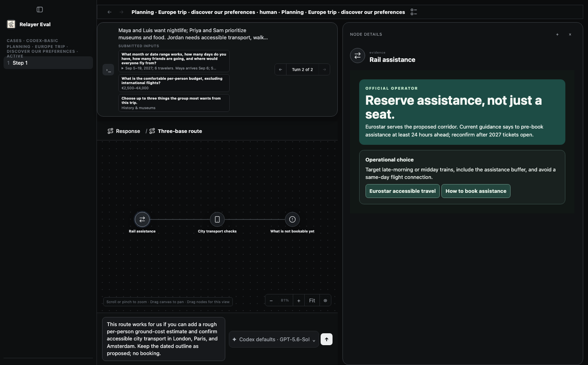

# Actor v2 — manual calibration after the first live run

The user approved improving realism and intent consistency, then repeating the
Europe-trip run. PRD §13.2.3 and ADR 0003 now record that decision. This brings
existing private case briefs into the actor context; it does not implement a
new persona generator, independent judge, or automatic improvement loop.

## Changed seams and checkpoints

| Promise / boundary | Seam | Proof |
| --- | --- | --- |
| Known preferences stay available to actor, not candidate or grading feedback | Versioned actor prompt from `prepared.humanBrief`; existing task prompt dispatch | Actor service trajectory test: private brief in actor prompt; rubric absent, brief absent from observations; unchanged scoped gateway tests |
| Low effort means brief natural responses without contradicting known facts | `task-actor-v2` prompt | Prompt inspection and separately authorized live run; behavioral quality is not certified by unit tests |
| Satisfaction does not mean completion | Action schema/validation, recorded actor rating | Production service test: satisfied/incomplete persists across reopen; contradictory reached/pending-work rejected |
| Human reviewers can flag specific actor decisions | Graph review event selector → existing annotation service | Browser active-review chapter selects an actor action and saves feedback; service reopen preserves the action annotation |
| Actor cannot see human calibration feedback | Separate actor capability and observation | Browser actor continues after review; feedback absent from actor observations; existing route denial tests |
| Unsupported model/effort rejected before candidate inference | Config → provider catalog discovery under connection lease → task creation | Provider fixture test and actor-error service test; no paid model call |
| Runtime diagnostics are actionable and contain no raw provider payload | Closed actor error categories and fixed messages | Actor-error tests use credential-bearing native errors; only safe categories/messages survive |
| Changed seams remain selected in affected CI | Desktop/eval-runner portfolios | Planner regression includes actor-error suite |

## Verification plan and status

Run focused actor, provider, error, session, gateway and CI-planner checks.
Required final gates: `npm run check`, `npm run build`, `npm run test:eval-web`.
Then run one authorized live session using GPT-5.6 Luna, low reasoning/effort,
three candidate completions and twenty actor actions on the same trip case.

Focused tests passed. Final `npm run check` passed: native formatting/clippy,
workspace and crash-recovery tests, package/type checks, 3,234 JavaScript tests
(three skipped), two secret-boundary tests, 60 Python tests, receipt lint and PRD
readability. All nine `npm run test:eval-web` chapters passed, including active
actor-action feedback isolation. Final `npm run build` passed. The authorized v2 live rerun ended at its 15-minute actor deadline; see the recorded outcome below. No live
improvement is claimed until its actual trajectory is inspected. Catalog
availability is a preflight check, not a guarantee against a later provider
rejection or account change. Runtime failures retain safe diagnostics.

## Prior live baseline

The v1 GPT-6 Luna request was rejected by the native Codex route. A second run
using GPT-5.6 Luna completed with two candidate turns and eight actor actions.
It selected an 8–10 day duration, obtained three route options, and declared the
endpoint reached at satisfaction 3/4 while group decisions remained open.

That run had no private user brief. The v2 run deliberately adds the known
six-person group's dates, $4,500 pre-flight budget, mobility needs, shared weekend,
and preferences. This is an iteration, not a controlled estimate of a model's
quality: profile availability and prompt behavior both change. Human review
still determines whether it behaved naturally and interpreted the endpoint well.

## Adversarial review

Reviewer `/root/eval_facts` found no unresolved findings across the 13 changed
source/test files in [the scope manifest](actor-v2-review-scope.json), digest
`353ecfe80f94c5891b07a4da0d43a4fcb7cee318cc529483a4fdeba397b59ec7`.
Digest algorithm: sorted relative path + NUL + raw SHA-256 of each file.
Reviewed privacy, preflight authority, finish consistency, action annotation,
safe diagnostics, and CI selection. Independently ran 38 actor/provider/error
tests and 82 planner tests, all passing. Source changes invalidate this review.
Behavioral realism and live outcome remain outside deterministic certification.

## Live v2 outcome

[Recorded trajectory](actor-v2-live-summary.json), session
`human-d54b531e-98ce-418b-bbfe-84ee1af18656`, uses prompt `task-actor-v2`,
GPT-5.6 Luna/low as actor and GPT-5.6 Sol as candidate. Catalog preflight passed.
It admitted three response turns and performed eleven actor actions. The actor
hit its 15-minute wall-clock deadline without a finish action or satisfaction
rating. All three candidate responses were accepted; the last finished about
2.2 seconds after actor interruption. The actor did not review that final result.
No task-success claim, automatic resumption, or additional paid rerun was made.

Engineering observations (not a human grade or independent judge result):

- The actor supplied the actual September dates, arrival/departure differences,
  shared weekend, mobility needs, pace and tastes from the private brief.
- It inspected the three-base route and accessibility evidence, then requested
  cost estimates and accessible city transport before agreement. It did not
  repeat the baseline's premature endpoint claim during the observed trajectory.
- Low-effort realism remains incomplete: the constraint message was long and
  polished. It also inferred an approximate euro budget rather than preserving
  the exact dollar cap in its follow-up. These need further manual calibration.
- Recorded first-visible-graph time was 250.4 seconds, with the observer attached
  after submission and usefulness unassessed. This is not a calibrated latency
  benchmark. Long candidate waits consumed most of the wall-clock deadline.

## Hosted CI qualification

Local required gates passed on the reviewed executable source. Hosted CI for
head `e5ab29cd`, synthetic merge `8eb23427` against main `77aa24de`, failed the
new main-side `test/design-config.test.mjs`: expected 282 rows, received 172.
That test and its prototype checker are byte-identical on main and the merge;
no actor-change file overlaps them. Main CI passed and four read-only local
runs produced 282 rows. Immediate process exit after console output is the likely
truncation cause; exact Linux reproduction remains unverified. The separate
freshness-refresh failure involved publication for another PR. Neither failure
is treated as a successful hosted check, and no unchanged CI rerun was issued.
